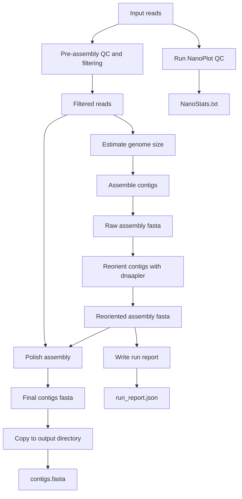

# Assemble Workflow Data Flow

This diagram captures the data flow and process order implemented by the assemble workflow.

```mermaid
flowchart TD
    A[Input reads] --> B[Pre-assembly QC and filtering]
    B --> C[Filtered reads]
    C --> D[Estimate genome size]
    D --> E[Assemble contigs]
    E --> F[Raw assembly fasta]
    F --> G[Reorient contigs with dnaapler]
    G --> H[Reoriented assembly fasta]
    H --> I[Polish assembly]
    C --> I
    I --> J[Final contigs fasta]
    J --> K[Copy to output directory]
    K --> L[contigs.fasta]
    H --> M[Write run report]
    M --> N[run_report.json]
    A --> O[Run NanoPlot QC]
    O --> P[NanoStats.txt]
```
