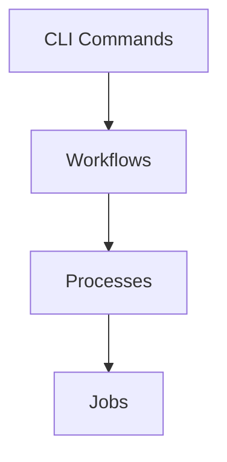

# Developer Guide

This document explains how uONT is structured, how the hierarchy of jobs → processes → workflows → CLI commands works, and the steps required to extend the pipeline safely.



## Architectural overview

1. **Jobs (`src/uont/jobs.py`)**
    - Thin wrappers around external tools (e.g., `chopper`, `porechop`, `autocycler`, `medaka`).
    - Handle command construction, logging, and temporary directory management.
    - Never make assumptions about orchestration; they only execute a single responsibility.

2. **Processes (`src/uont/process.py`)**
    - Higher-level helpers that select and invoke jobs based on configuration (tool choice, thresholds, etc.).
    - Provide validation (`ValueError` for unsupported tools) and glue logic (e.g., `process_downsample_reads_to_target_depth` calculating target bases).

3. **Workflows (`src/uont/workflow.py`)**
    - Orchestrate multiple processes into an end-to-end pipeline (e.g., `wf_assemble` runs filtering → genome-size estimation → downsampling → assembly → polishing).
    - Keep filesystem orchestration (output directories) and logging readable.

4. **CLI (`src/uont/cli.py`)**
    - Uses the introspection logic to expose every `process_*` and `job_*` function as a subcommand.
    - Provides workflow subcommands (e.g., `workflow assemble`) for common end-to-end runs.

The flow is therefore: **CLI command → workflow → processes → jobs**.

## Naming conventions

!!! warning "Naming conventions"
    
    In order to maintain a clear and predictable structure, the following naming conventions are used throughout the codebase. This is also important to register jobs and processes correctly in the CLI via introspection.

- **Processes:** Name each function `process_<process_type>` where `<process_type>` describes the conceptual action (e.g., `process_assemble`, `process_read_filter`). This keeps auto-discovery predictable and helps users infer intent from the CLI.
- **Jobs:** Use `job_<process_type>_<implemented_tool>` so callers see both the action and the specific tool implementation (e.g., `job_assemble_autocycler`, `job_read_filter_chopper`). This aligns the hierarchy with the available toolchain and avoids ambiguous names.

## Type annotation requirements

- Every job, process, or workflow function must have complete type annotations. The CLI registration logic relies on `inspect.signature()` to infer argument types and instantiate argparse parameters.
- All filesystem paths must use the `FullPath` newtype defined in `src/uont/types.py`. This ensures consistent CLI handling (e.g., `FullPath` parameters trigger conversion via `file_path()` when building CLI arguments) and makes path intent obvious throughout the codebase.
- Use `typing.Literal` for parameters that have fixed choices (e.g., `Literal["chopper"]` for filter tools). The CLI parser reads these Literals to populate `choices=` in argparse automatically, so forgetting them means users will not see constrained options.
- Failure to annotate parameters (or using plain `str` instead of `FullPath` for paths) will prevent automatic CLI registration from wiring those functions correctly.

## Adding a new job

1. Implement the function in `src/uont/jobs.py` as `job_<name>`.
   - Include type annotations for every argument and the return value (`-> None` if nothing is returned).
   - Use `FullPath` for any path inputs/outputs.
   - Provide a docstring with typed argument descriptions for documentation consistency.
2. If the job requires temp directories, decorate with `@run_in_tempdir`.
3. Add logging that clearly states the command being run.
4. Because the CLI auto-discovers functions starting with `job_`, no extra registration is needed; the name will automatically become a subcommand (`job foo_bar` → `python -m uont.cli job foo-bar`).

## Adding a new process

1. Create a function in `src/uont/process.py` named `process_<name>`.
2. Annotate all parameters, using `FullPath` and `Literal[...]` as appropriate.
3. Within the process, call the relevant job(s) and perform any validation/aggregation needed.
4. Update documentation (`docs/api/process.md`) if necessary.
5. The CLI automatically exposes `process_<name>` as `python -m uont.cli process <name>`.

## Adding a new workflow

1. Add a function in `src/uont/workflow.py` (e.g., `wf_<name>`).
2. Annotate all parameters and use type hints for tool selections (often via `SimpleNamespace`).
3. Compose the required processes/jobs to achieve the desired pipeline.
4. Update the CLI (`cli.py`) if you want a dedicated workflow subcommand, or document how to invoke it programmatically.


## Summary checklist for new functionality

- [ ] Add job(s) under `src/uont/jobs.py` with full type annotations and docstrings.
- [ ] Add process-level helpers (if needed) that call the new jobs and validate inputs.
- [ ] Extend workflows to include the new process, or create a new workflow.
- [ ] Ensure every function uses `FullPath` for path arguments.
- [ ] Run the CLI to confirm the new commands appear (`python -m uont.cli --help`).
- [ ] Update documentation (e.g., `docs/index.md`, `docs/api/*.md`, or this guide) to track new capabilities.

Following this hierarchy keeps the pipeline predictable and ensures the CLI’s auto-registration mechanism stays reliable.

## Simple Example: Adding raven as a new assembler

Raven is a long-read assembler that can be used as an alternative to Autocycler or Flye. Raven can be run as following:

```bash
raven <input.fastq.gz> -t 4 > out.fasta
```

So it needs the input reads and the number of threads, and it outputs a FASTA assembly to stdout. To add Raven as an option to perform assemblies we should wrap this command in a function within the `src/uont/jobs.py` file. We can call this job `job_assemble_raven`:

```python
@run_in_tempdir
def job_assemble_raven(
    input_fastq: FullPath, 
    output_assembly: FullPath, 
    threads: int,
    **kwargs
) -> None:
    cmd = f"raven {input_fastq} -t {threads} > raven_assembly.fasta"
    run_cmd(cmd)
    shutil.copy("raven_assembly.fasta", output_assembly)
```

!!! warning "Syntax"
    This function uses the `@run_in_tempdir` decorator to ensure that any intermediate files created during the Raven assembly process are stored in a temporary directory and cleaned up automatically after the job completes. The function constructs the command to run Raven with the specified input FASTQ file and number of threads, executes it, and then copies the resulting assembly to the specified output path.

    The `FullPath` type annotations ensure that the CLI can correctly handle file paths when this job is invoked from the command line. 
    
    The `**kwargs` allows for any additional parameters to be passed from the process layer without causing errors, providing flexibility for future extensions. 
    
    The `-> None` return type annotation indicates that this function does not return any value, which is appropriate for a job that performs an action (running a command) rather than producing a return value.


After implementing the job we should be able to see it as a option when we run `uont job --help` and we can also call it directly via the following command:
```bash
uont job assemble-raven --input path/to/reads.fastq.gz --output path/to/assembly.fasta --threads 4
```

## More complicated example: Adding `miniasm` as an assembler

Implementing raven was straightforward because it is a single command that takes the input reads and produces an assembly. However, some tools require more complex logic to run correctly. For example, miniasm requires two steps: first running minimap2 to generate overlaps between reads, and then running miniasm on those overlaps to produce the assembly. Additionally, miniasm outputs a GFA file that needs to be converted to FASTA format. This means that the job function for miniasm will need to handle multiple commands and some custom logic to process the output.

In addition, if we want the user to be able to use miniasm as an option in the `process_assemble` function, we will need to extend the process enable the use of the `job_assemble_miniasm` we will create when the user selects miniasm as the assembler. Finally, we should also update the workflow to allow users to select miniasm as an assembler option when running the end-to-end assembly workflow.

1. **Job:** Implement `job_assemble_miniasm` in `src/uont/jobs.py`. 

The function should wrap the miniasm commands that are used as a minimum and you can also add logging if you want.  The pipeline creates temporary intermediate files it is best to use the `@run_in_tempdir` decorator so that files are created in a temporary directory and cleaned up automatically. Finally you should 
    copy the resulting assembly to the specified output path. Here is what the implementation might look like:

    ```python
    # src/uont/jobs.py
    @run_in_tempdir
    def job_assemble_miniasm(
        input_fastq: FullPath, 
        output_assembly: FullPath, 
        threads: int,
        **kwargs
    ) -> None:
        """
        Assemble reads using miniasm.

        Args:
            input_fastq: Path to the input FASTQ file.
            output_assembly: Path where the assembly FASTA will be written.
            genome_size: Estimated genome size for assembly parameters.
            threads: Number of threads to use for assembly.
        """
        logging.info(f"Running miniasm with input: {input_fastq}")

        # First we run minimap2 to generate the overlaps (not shown here), then we run miniasm on the overlaps.
        cmd = f"minimap2 -x ava-ont -t {threads} {input_fastq} {input_fastq} | pigz -c > overlaps.paf.gz"
        run_cmd(cmd)

        # Construct and log the miniasm command here
        cmd = f"miniasm -f {input_fastq} overlaps.paf.gz > miniasm_assembly.gfa"
        # Execute the command (e.g., via subprocess)
        run_cmd(cmd)

        # The output of miniasm is a GFA file. We need to convert it to FASTA format. 
        for line in open("miniasm_assembly.gfa"):
            if line.startswith("S"):
                parts = line.strip().split("\t")
                contig_name = parts[1]
                contig_seq = parts[2]
                with open("miniasm_assembly.fasta", "a") as fasta_out:
                    fasta_out.write(f">{contig_name}\n{contig_seq}\n")
        
        # Copy the output assembly to the final destination if needed (e.g., if miniasm writes to a temp file)
        shutil.copy("miniasm_assembly.fasta", output_assembly)

    ```

    !!! warning "Syntax"
        We added the `FullPath` type annotations to ensure this job is correctly registered in the CLI and that the files are processed correctly when using the command line interface. The `@run_in_tempdir` decorator ensures that any intermediate files created during the miniasm assembly process are stored in a temporary directory and cleaned up automatically after the job completes, keeping the filesystem tidy.

    

2. **Process:** Extend `process_assemble` so the `assembler` parameter uses `Literal["autocycler", "flye", "miniasm"]`. Inside the function add a branch that dispatches to `job_assemble_miniasm`, passing through relevant kwargs such as `threads`. For example, we'll first need to import the new job at the top of `process.py`:

    ```python
    # src/uont/process.py
    from .jobs import (
        # ... existing imports ...
        job_assemble_miniasm
    )
    ```

    We can then add the new assembler option in the process function:

    ```python
    # src/uont/process.py
    def process_assemble(
        input_fastq: FullPath,
        output_fasta: str,
        threads: int = 4,
        assembler: Literal["autocycler", "flye", "miniasm"] = "autocycler",
        **kwargs
    ) -> None:
    # ... existing logic for autocycler and flye ...

    if assembler == "miniasm":
            job_assemble_miniasm(
                input_reads=input_fastq,
                output_assembly=output_fasta,
                threads=threads,
                **kwargs
            )

    # ... existing polishing logic ...
    ```

    This way, the assemble process remains agnostic to the specific assembler implementation while still allowing users to select miniasm as an option. The process function handles the orchestration and validation, while the job function encapsulates the specific command logic for miniasm.

3. **Workflow:** Update `wf_assemble` to accept `tools.assembler == "miniasm"` and forward miniasm-specific arguments into `process_assemble`. This keeps the workflow agnostic while still allowing tool-specific tuning where needed. For example:
```python
    def wf_assemble(
        input_fastq: FullPath,
        output_dir: FullPath,
        assembler_tool: Literal["autocycler", "flye", "miniasm"] = "autocycler",
        polishing_tool: Optional[Literal["medaka"]] = None,
        threads: int = 4,
        **kwargs
    ) -> None:
        # ... existing workflow logic ...

        # ... Nothing needs to change since the assembler choice is passed through to process_assemble, which handles the dispatching. This keeps the workflow clean and focused on orchestration.
```

4. **CLI:** Thanks to auto-registration, no manual CLI wiring is necessary for it to be activated under the process and job CLI commands. After updating the job/process, run `python -m uont.cli process assemble --help` to verify `miniasm` appears under the `--assembler-tool` choices, and optionally test the new `job assemble-miniasm` command directly. Howver since we have specially set up a custom argparser for the `assemble` workflow, we may need to add the `miniasm` option to the `assemble` workflow subparser in `cli.py` to ensure it appears in the CLI help and can be invoked directly. This would involve adding `miniasm` to the choices for the assembler argument in the workflow subparser definition.

``` python       
    assemble_wf_parser.add_argument(
        "--assembler-tool",
        type=str,
        default="autocycler",
        choices=["autocycler","flye","miniasm"],  # Add miniasm to the choices here
        help="The assembler to use for assembly",
    )
```
5. **Docs/tests:** Document the new assembler in `docs/index.md` or API references, and add regression tests (unit or integration) plus example data if available so miniasm support stays covered during future refactors.