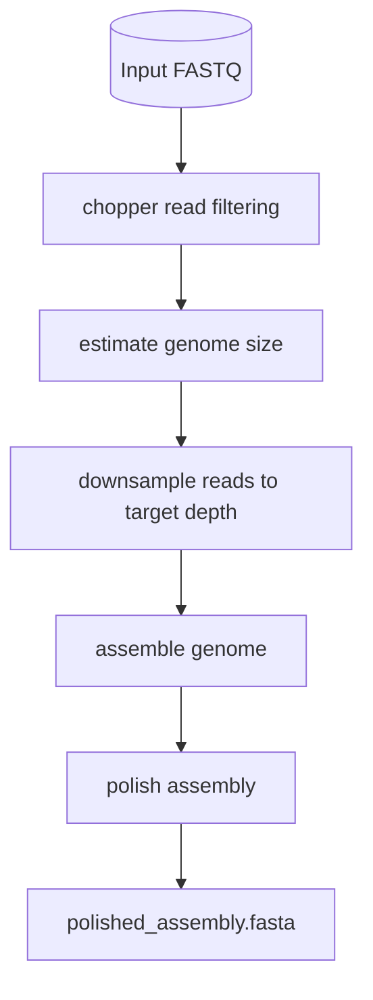

# uONT

This is the uONT package documentation. It provides a set of tools and utilities for processing and analyzing Oxford Nanopore sequencing data. The package includes modules for command-line interface (CLI), data processing, and type definitions.

## Overview

uONT is a batteries-included pipeline that covers the complete journey from raw Nanopore reads to polished assemblies. It bundles individual jobs (wrappers around third-party tools), process-level helpers that pick the right job based on user configuration, and high-level workflows that combine those steps into reproducible runs. The CLI mirrors this structure so you can either invoke the end-to-end workflow or just run a single job for troubleshooting.

### Key features
- Barcode-aware collation of multiplexed runs driven by sample sheets.
- Adapter trimming, quality filtering, and depth-aware downsampling to standardize read sets.
- Genome-size estimation plus Autocycler/Flye assembly support with optional Medaka polishing.
- Consistent CLI which makes swapping out tools or running individual steps easy for debugging and customization.

## Quick start
1. Install dependencies (via `pixi install` or `pip install -e .`).
2. Run the CLI:
   ```bash
    uont workflow assemble \
        --input path/to/reads.fastq.gz \
        --output-dir results/ \
        --assembler-tool autocycler \
        --polishing-tool medaka
   ```
3. Inspect the generated `polished_assembly.fasta` file under the output directory.

You can also invoke specific processes (e.g., `uont process fastq-filter ...`) to debug or swap out stages.

For example, just want to run autocycler on some reads you have already filtered and downsampled? You can do that with:

```bash
uont job autocycler-assemble \
    --input-fastq path/to/filtered_downsampled_reads.fastq.gz \
    --output-fasta path/to/autocycler_assembly.fasta \
    --threads 8
```

## Assemble workflow (default settings)



## Modules
- [uont.cli](./api/cli.md): Command-line interface functions for running the uONT workflow and individual processing steps.
- [uont.process](./api/process.md): Core processing functions that implement specific tasks such as filtering reads, removing adapters, estimating genome size, downsampling reads, assembling genomes, and polishing assemblies.
- [uont.jobs](./api/jobs.md): Job functions that perform specific tasks in the uONT workflow, designed to be called by the process functions and served as command implementations for the CLI interface.
- [uont.workflow](./api/workflow.md): Higher-level workflow functions that orchestrate the overall processing logic and tool selection, calling the appropriate process functions to execute the steps of the workflow.