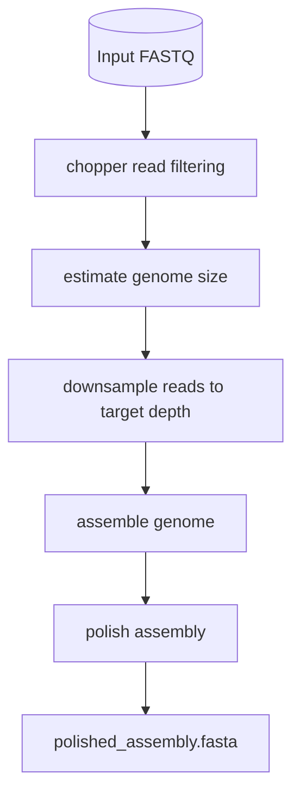

# uont

This is the uont package documentation. It provides a set of tools and utilities for processing and analyzing Oxford Nanopore sequencing data. The package includes modules for command-line interface (CLI), data processing, and type definitions.

## Overview

uont is a batteries-included pipeline that covers the complete journey from raw Nanopore reads to polished assemblies. It bundles individual jobs (wrappers around third-party tools), process-level helpers that pick the right job based on user configuration, and high-level workflows that combine those steps into reproducible runs. The CLI mirrors this structure so you can either invoke the end-to-end workflow or just run a single job for troubleshooting.

### Key features
- Barcode-aware collation of multiplexed runs driven by sample sheets.
- Adapter trimming, quality filtering, and depth-aware downsampling to standardize read sets.
- Genome-size estimation plus Autocycler/Flye assembly support with optional Medaka polishing.
- Consistent CLI which makes swapping out tools or running individual steps easy for debugging and customization.

## Install 

### With conda/mamba/micromamba

```
conda install -c conda-forge -c bioconda jodyphelan::uont
```

### Extra setup
You'll need to have dorado, the dorado basecalling models and the plassembler database installed. You can do this with the `setup` command:

```bash
uont setup
```

### Check installation

You can check that all dependencies are installed and available in your PATH with the `check` command:

```bash
uont deps
```

## Quick start
1. Install uont and run the setup command to install dorado, the dorado basecalling models and the plassembler database. (above)
2. Run the CLI:
   ```bash
    uont workflow assemble \
        --input-reads path/to/reads.fastq.gz \
        --output-dir results/ \
        --threads 8 
   ```
3. Inspect the output directory with your polished assembly.

### Output files

The output directory will contain the following files:
    - `contigs.fasta`: the final polished assembly
    - `run_report.json`: a JSON file with run statistics and metadata
    - `intermediate_assembly_files`: a directory containing intermediate files from all the individual assemblers run by autocycler, which can be used for troubleshooting or further analysis.

### Tweaking the workflow
You can tweak the workflow by changing the command line arguments. For example, you can change the assembler used by autocycler, or change the polishing method. See the [CLI documentation](./api/cli.md) for a full list of options.

#### Changing the assemblers used by autocycler
You can change the assemblers used by autocycler by using the `--assemblers` argument. For example, to use only myloasm and raven, you can run:
```bash
uont workflow assemble \
    --input-reads path/to/reads.fastq.gz \
    --output-dir results/ \
    --threads 8 \
    --assemblers myloasm raven
```

#### Changing the number of subsamples used by autocycler
You can change the number of subsamples used by autocycler by using the `--max-samples` argument. For example, to use 2 subsamples, you can run:
```bash
uont workflow assemble \
    --input-reads path/to/reads.fastq.gz \
    --output-dir results/ \
    --threads 8 \
    --max-samples 2
```

#### Computational resources
The workflow can be run on a single machine with multiple threads. Almost all of the tools used in the workflow are multithreaded, so you can speed up the workflow by increasing the number of threads. This can be changed with the `--threads` argument. For example, to use 16 threads, you can run:
```bash
uont workflow assemble \
    --input-reads path/to/reads.fastq.gz \
    --output-dir results/ \
    --threads 16
```

The most computationally intensive step is creating the assemblies with the different assemblers. There are two important parameters that control how many assemblies are run in parallel and how many threads are used by each assembler. These are `--parallel-assembly-jobs` and `--threads-per-assembly`. The default is to run 1 assembler in parallel with 4 threads each. You can change this with the following command:

```bash
uont workflow assemble \
    --input-reads path/to/reads.fastq.gz \
    --output-dir results/ \
    --parallel-assembly-jobs 4 \
    --threads-per-assembly 8
```

## Assemble workflow (default settings)


```mermaid
flowchart TD
	RAW[(Input FASTQ)] --> FILTER[chopper read filtering]
	FILTER --> ESTIMATE[estimate genome size]
	ESTIMATE --> DOWNSAMPLE[downsample reads to target depth]
	DOWNSAMPLE --> ASSEMBLE[assemble genome]
	ASSEMBLE --> POLISH[polish assembly]
	POLISH --> OUTPUT[polished_assembly.fasta]
```

## Modules
- [uont.cli](./api/cli.md): Command-line interface functions for running the uont workflow and individual processing steps.
- [uont.process](./api/process.md): Core processing functions that implement specific tasks such as filtering reads, removing adapters, estimating genome size, downsampling reads, assembling genomes, and polishing assemblies.
- [uont.jobs](./api/jobs.md): Job functions that perform specific tasks in the uont workflow, designed to be called by the process functions and served as command implementations for the CLI interface.
- [uont.workflow](./api/workflow.md): Higher-level workflow functions that orchestrate the overall processing logic and tool selection, calling the appropriate process functions to execute the steps of the workflow.