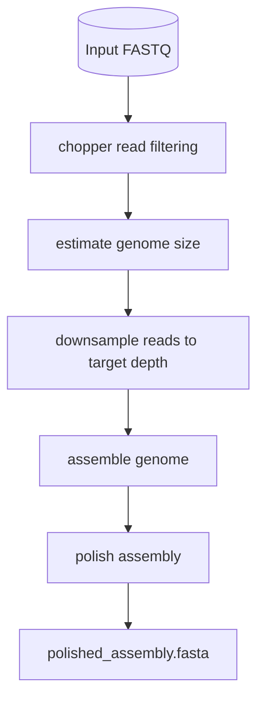

# uONT

This is the uONT package documentation. It provides a set of tools and utilities for processing and analyzing Oxford Nanopore sequencing data. The package includes modules for command-line interface (CLI), data processing, and type definitions.

## Overview

uONT is a batteries-included pipeline that covers the complete journey from raw Nanopore reads to polished assemblies. It bundles individual jobs (wrappers around third-party tools), process-level helpers that pick the right job based on user configuration, and high-level workflows that combine those steps into reproducible runs. The CLI mirrors this structure so you can either invoke the end-to-end workflow or just run a single job for troubleshooting.

### Key features
- Barcode-aware collation of multiplexed runs driven by sample sheets.
- Adapter trimming, quality filtering, and depth-aware downsampling to standardize read sets.
- Genome-size estimation plus Autocycler/Flye assembly support with optional Medaka polishing.
- Consistent CLI which makes swapping out tools or running individual steps easy for debugging and customization.

## Install 

### With conda/mamba/micromamba

```
conda install -c conda-forge -c bioconda jodyphelan::uont
```

### Extra setup
You'll need to have dorado, the dorado basecalling models and the plassembler database installed. You can do this with the `setup` command:

```bash
uont setup
```

### Check installation

You can check that all dependencies are installed and available in your PATH with the `check` command:

```bash
uont deps
```

## Quick start
1. Install uONT and run the setup command to install dorado, the dorado basecalling models and the plassembler database. (above)
2. Run the CLI:
   ```bash
    uont workflow assemble \
        --input-reads path/to/reads.fastq.gz \
        --output-dir results/ \
        --threads 8 
   ```
3. Inspect the output directory. It should include:
    - `contigs.fasta`: the final polished assembly
    - `run_report.json`: a JSON file with run statistics and metadata
    - `intermediate_assembly_files`: a directory containing intermediate files from all the individual assemblers run by autocycler, which can be used for troubleshooting or further analysis.


## Assemble workflow (default settings)


```mermaid
flowchart TD
	RAW[(Input FASTQ)] --> FILTER[chopper read filtering]
	FILTER --> ESTIMATE[estimate genome size]
	ESTIMATE --> DOWNSAMPLE[downsample reads to target depth]
	DOWNSAMPLE --> ASSEMBLE[assemble genome]
	ASSEMBLE --> POLISH[polish assembly]
	POLISH --> OUTPUT[polished_assembly.fasta]
```

## Modules
- [uont.cli](./api/cli.md): Command-line interface functions for running the uONT workflow and individual processing steps.
- [uont.process](./api/process.md): Core processing functions that implement specific tasks such as filtering reads, removing adapters, estimating genome size, downsampling reads, assembling genomes, and polishing assemblies.
- [uont.jobs](./api/jobs.md): Job functions that perform specific tasks in the uONT workflow, designed to be called by the process functions and served as command implementations for the CLI interface.
- [uont.workflow](./api/workflow.md): Higher-level workflow functions that orchestrate the overall processing logic and tool selection, calling the appropriate process functions to execute the steps of the workflow.